# Retrospective analysis summary for  my.syndromic


```r
# loading and preparing the data to work with
load("my.syndromic.RData")
require(vetsyn)
matrix.week <- x@observed
frequency = 52
```


## Abortion

```r
# create time series
s = 1
week <- matrix.week[, s]
week.ts <- ts(week, start = c(x@dates$year[1], x@dates$week[1]), frequency = frequency)
t = 1:length(week)
```


```r
# Plot series
plot(week.ts, xlab = "Weeks", main = "Weeks")
```

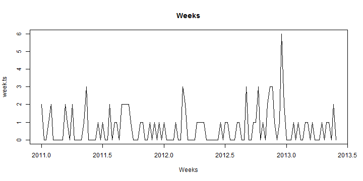 


### Summary statistics

```r
# Percentiles
quantile(week, probs = c(0, 0.25, 0.5, 0.75, 1), names = FALSE)
```

```
## [1] 0 0 0 1 6
```

```r
round(mean(week), 4)
```

```
## [1] 0.6905
```

```r

# Number of weeks at minimum value
(countInMin <- length(which(week == min(week))))
```

```
## [1] 69
```

```r
(percentInMin <- round(((countInMin)/(length(week))) * 100, 2))
```

```
## [1] 54.76
```


```r
# ACF and PACF
acf(week, main = "ACF for weekly data", lag.max = (frequency + 5))
```

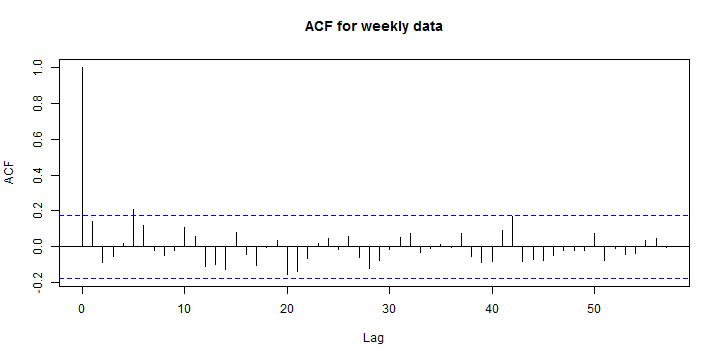 

```r
pacf(week, main = "PACF for weekly data", lag.max = (frequency + 5))
```

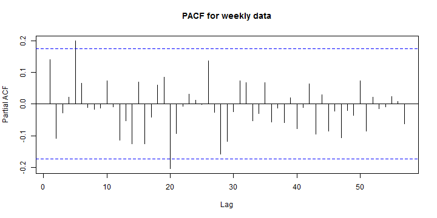 


### Crude (visual) assessment of temporal effects

```r
boxplot(week ~ x@dates$week, main = "Week of the year")
```

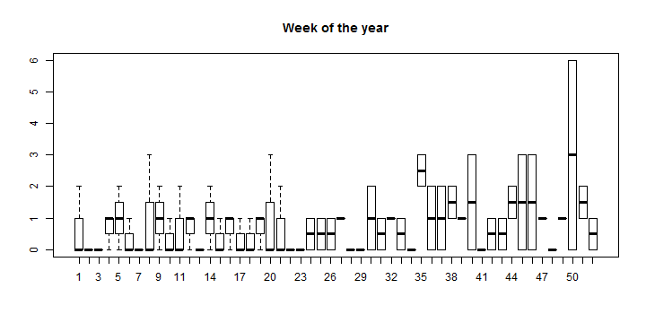 

```r
boxplot(week ~ x@dates$year, main = "Year")
```

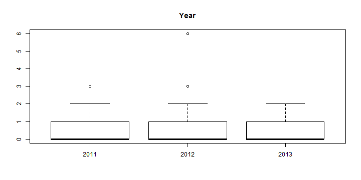 


### POISSON  Regression with sin/cos wave

```r
distribution = "poisson"

cos = cos(2 * pi * t/frequency)
sin = sin(2 * pi * t/frequency)
year.f <- as.factor(x@dates$year)
tminus1 <- c(week[1], week[1:(length(week) - 1)])
tminus2 <- c(week[1:2], week[1:(length(week) - 2)])
tminus3 <- c(week[1:3], week[1:(length(week) - 3)])
tminus4 <- c(week[1:4], week[1:(length(week) - 4)])

fit1 = glm(week ~ year.f, family = distribution)
fit1AR1 = glm(week ~ year.f + tminus1, family = distribution)
fit1AR2 = glm(week ~ year.f + tminus1 + tminus2, family = distribution)
fit1AR3 = glm(week ~ year.f + tminus1 + tminus2 + tminus3, family = distribution)
fit1AR4 = glm(week ~ year.f + tminus1 + tminus2 + tminus3 + tminus4, family = distribution)

fit2 = glm(week ~ sin + cos, family = distribution)
fit2AR1 = glm(week ~ sin + cos + tminus1, family = distribution)
fit2AR2 = glm(week ~ sin + cos + tminus1 + tminus2, family = distribution)
fit2AR3 = glm(week ~ sin + cos + tminus1 + tminus2 + tminus3, family = distribution)
fit2AR4 = glm(week ~ sin + cos + tminus1 + tminus2 + tminus3 + tminus4, family = distribution)

fit3 = glm(week ~ t + sin + cos, family = distribution)
fit3AR1 = glm(week ~ t + sin + cos + tminus1, family = distribution)
fit3AR2 = glm(week ~ t + sin + cos + tminus1 + tminus2, family = distribution)
fit3AR3 = glm(week ~ t + sin + cos + tminus1 + tminus2 + tminus3, family = distribution)
fit3AR4 = glm(week ~ t + sin + cos + tminus1 + tminus2 + tminus3 + tminus4, 
    family = distribution)
```


```r
# Printing AICs
AR1 <- c(fit1 = fit1$aic, fit1AR1 = fit1AR1$aic, fit1AR2 = fit1AR2$aic, fit1AR3 = fit1AR3$aic, 
    fit1AR4 = fit1AR4$aic)
AR2 <- c(fit2 = fit2$aic, fit2AR1 = fit2AR1$aic, fit2AR2 = fit2AR2$aic, fit2AR3 = fit2AR3$aic, 
    fit2AR4 = fit2AR4$aic)
AR3 <- c(fit3 = fit3$aic, fit3AR1 = fit3AR1$aic, fit3AR2 = fit3AR2$aic, fit3AR3 = fit3AR3$aic, 
    fit3AR4 = fit3AR4$aic)


print(AR1)
```

```
##    fit1 fit1AR1 fit1AR2 fit1AR3 fit1AR4 
##   293.7   292.7   293.3   295.3   297.0
```

```r
print(AR2)
```

```
##    fit2 fit2AR1 fit2AR2 fit2AR3 fit2AR4 
##   289.5   289.7   288.8   290.4   292.4
```

```r
print(AR3)
```

```
##    fit3 fit3AR1 fit3AR2 fit3AR3 fit3AR4 
##   290.9   291.3   290.2   291.8   293.8
```


```r
plot(t, week, type = "l", main = "Poisson regression")
lines(fit1$fit, col = "red", lwd = 2)
lines(fit2$fit, col = "blue", lwd = 2)
lines(fit3$fit, col = "green", lwd = 2)
legend("topleft", pch = 3, col = c("red", "blue", "green"), c("year", "sin/cos", 
    "t + sin/cos"))
```

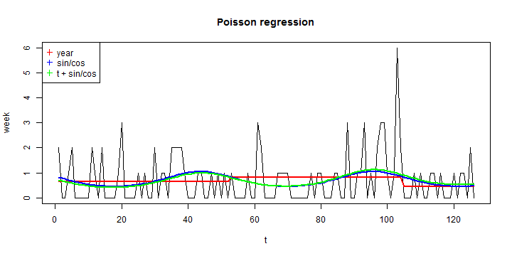 

```r

### Negative Binomial Regression with sin/cos wave
```

```r
require(MASS)
fitNB1 = glm.nb(week ~ year.f)
fitNB1AR1 = glm.nb(week ~ year.f + tminus1)
fitNB1AR2 = glm.nb(week ~ year.f + tminus1 + tminus2)
fitNB1AR3 = glm.nb(week ~ year.f + tminus1 + tminus2 + tminus3)
fitNB1AR4 = glm.nb(week ~ year.f + tminus1 + tminus2 + tminus3 + tminus4)

fitNB2 = glm.nb(week ~ sin + cos)
fitNB2AR1 = glm.nb(week ~ sin + cos + tminus1)
fitNB2AR2 = glm.nb(week ~ sin + cos + tminus1 + tminus2)
fitNB2AR3 = glm.nb(week ~ sin + cos + tminus1 + tminus2 + tminus3)
fitNB2AR4 = glm.nb(week ~ sin + cos + tminus1 + tminus2 + tminus3 + tminus4)

fitNB3 = glm.nb(week ~ t + sin + cos)
fitNB3AR1 = glm.nb(week ~ t + sin + cos + tminus1)
fitNB3AR2 = glm.nb(week ~ t + sin + cos + tminus1 + tminus2)
fitNB3AR3 = glm.nb(week ~ t + sin + cos + tminus1 + tminus2 + tminus3)
fitNB3AR4 = glm.nb(week ~ t + sin + cos + tminus1 + tminus2 + tminus3 + tminus4)
```


```r
# Printing AICs
AR_NB1 <- c(fitNB1 = fitNB1$aic, fitNB1AR1 = fitNB1AR1$aic, fitNB1AR2 = fitNB1AR2$aic, 
    fitNB1AR3 = fitNB1AR3$aic, fitNB1AR4 = fitNB1AR4$aic)
AR_NB2 <- c(fitNB2 = fitNB2$aic, fitNB2AR1 = fitNB2AR1$aic, fitNB2AR2 = fitNB2AR2$aic, 
    fitNB2AR3 = fitNB2AR3$aic, fitNB2AR4 = fitNB2AR4$aic)
AR_NB3 <- c(fitNB3 = fitNB3$aic, fitNB3AR1 = fitNB3AR1$aic, fitNB3AR2 = fitNB3AR2$aic, 
    fitNB3AR3 = fitNB3AR3$aic, fitNB3AR4 = fitNB3AR4$aic)
print(AR_NB1)
```

```
##    fitNB1 fitNB1AR1 fitNB1AR2 fitNB1AR3 fitNB1AR4 
##     291.1     291.1     291.8     293.8     295.7
```

```r
print(AR_NB2)
```

```
##    fitNB2 fitNB2AR1 fitNB2AR2 fitNB2AR3 fitNB2AR4 
##     287.9     288.7     288.0     289.7     291.7
```

```r
print(AR_NB3)
```

```
##    fitNB3 fitNB3AR1 fitNB3AR2 fitNB3AR3 fitNB3AR4 
##     289.6     290.4     289.7     291.4     293.3
```


```r
plot(t, week, type = "l", main = "Negative Binomial Regression")
lines(fitNB1$fit, col = "red", lwd = 2)
lines(fitNB2$fit, col = "blue", lwd = 2)
lines(fitNB3$fit, col = "green", lwd = 2)
legend("topleft", pch = 3, col = c("red", "blue", "green"), c("year", "sin/cos", 
    "t + sin/cos"))
```

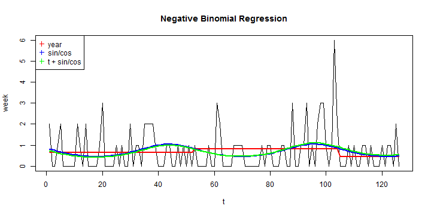 


## GIT

```r
# create time series
s = 2
week <- matrix.week[, s]
week.ts <- ts(week, start = c(x@dates$year[1], x@dates$week[1]), frequency = frequency)
t = 1:length(week)
```


```r
# Plot series
plot(week.ts, xlab = "Weeks", main = "Weeks")
```

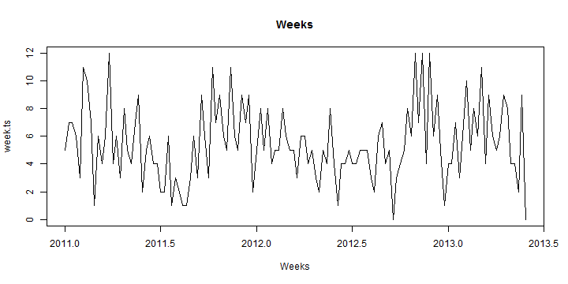 


### Summary statistics

```r
# Percentiles
quantile(week, probs = c(0, 0.25, 0.5, 0.75, 1), names = FALSE)
```

```
## [1]  0  4  5  7 12
```

```r
round(mean(week), 4)
```

```
## [1] 5.468
```

```r

# Number of weeks at minimum value
(countInMin <- length(which(week == min(week))))
```

```
## [1] 2
```

```r
(percentInMin <- round(((countInMin)/(length(week))) * 100, 2))
```

```
## [1] 1.59
```


```r
# ACF and PACF
acf(week, main = "ACF for weekly data", lag.max = (frequency + 5))
```

 

```r
pacf(week, main = "PACF for weekly data", lag.max = (frequency + 5))
```

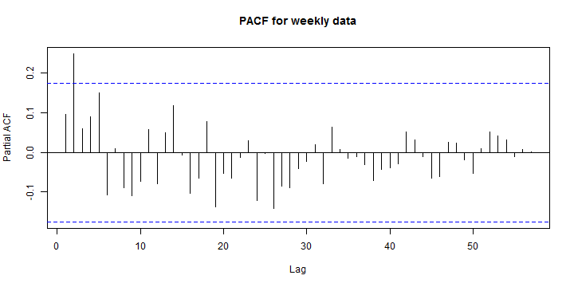 


### Crude (visual) assessment of temporal effects

```r
boxplot(week ~ x@dates$week, main = "Week of the year")
```

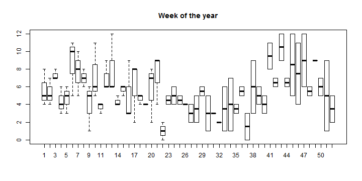 

```r
boxplot(week ~ x@dates$year, main = "Year")
```

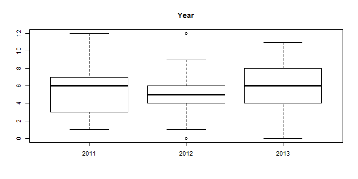 


### POISSON  Regression with sin/cos wave

```r
distribution = "poisson"

cos = cos(2 * pi * t/frequency)
sin = sin(2 * pi * t/frequency)
year.f <- as.factor(x@dates$year)
tminus1 <- c(week[1], week[1:(length(week) - 1)])
tminus2 <- c(week[1:2], week[1:(length(week) - 2)])
tminus3 <- c(week[1:3], week[1:(length(week) - 3)])
tminus4 <- c(week[1:4], week[1:(length(week) - 4)])

fit1 = glm(week ~ year.f, family = distribution)
fit1AR1 = glm(week ~ year.f + tminus1, family = distribution)
fit1AR2 = glm(week ~ year.f + tminus1 + tminus2, family = distribution)
fit1AR3 = glm(week ~ year.f + tminus1 + tminus2 + tminus3, family = distribution)
fit1AR4 = glm(week ~ year.f + tminus1 + tminus2 + tminus3 + tminus4, family = distribution)

fit2 = glm(week ~ sin + cos, family = distribution)
fit2AR1 = glm(week ~ sin + cos + tminus1, family = distribution)
fit2AR2 = glm(week ~ sin + cos + tminus1 + tminus2, family = distribution)
fit2AR3 = glm(week ~ sin + cos + tminus1 + tminus2 + tminus3, family = distribution)
fit2AR4 = glm(week ~ sin + cos + tminus1 + tminus2 + tminus3 + tminus4, family = distribution)

fit3 = glm(week ~ t + sin + cos, family = distribution)
fit3AR1 = glm(week ~ t + sin + cos + tminus1, family = distribution)
fit3AR2 = glm(week ~ t + sin + cos + tminus1 + tminus2, family = distribution)
fit3AR3 = glm(week ~ t + sin + cos + tminus1 + tminus2 + tminus3, family = distribution)
fit3AR4 = glm(week ~ t + sin + cos + tminus1 + tminus2 + tminus3 + tminus4, 
    family = distribution)
```


```r
# Printing AICs
AR1 <- c(fit1 = fit1$aic, fit1AR1 = fit1AR1$aic, fit1AR2 = fit1AR2$aic, fit1AR3 = fit1AR3$aic, 
    fit1AR4 = fit1AR4$aic)
AR2 <- c(fit2 = fit2$aic, fit2AR1 = fit2AR1$aic, fit2AR2 = fit2AR2$aic, fit2AR3 = fit2AR3$aic, 
    fit2AR4 = fit2AR4$aic)
AR3 <- c(fit3 = fit3$aic, fit3AR1 = fit3AR1$aic, fit3AR2 = fit3AR2$aic, fit3AR3 = fit3AR3$aic, 
    fit3AR4 = fit3AR4$aic)


print(AR1)
```

```
##    fit1 fit1AR1 fit1AR2 fit1AR3 fit1AR4 
##   613.2   613.9   605.5   607.0   607.7
```

```r
print(AR2)
```

```
##    fit2 fit2AR1 fit2AR2 fit2AR3 fit2AR4 
##   590.8   592.6   591.6   593.5   595.4
```

```r
print(AR3)
```

```
##    fit3 fit3AR1 fit3AR2 fit3AR3 fit3AR4 
##   592.7   594.5   593.5   595.4   597.3
```


```r
plot(t, week, type = "l", main = "Poisson regression")
lines(fit1$fit, col = "red", lwd = 2)
lines(fit2$fit, col = "blue", lwd = 2)
lines(fit3$fit, col = "green", lwd = 2)
legend("topleft", pch = 3, col = c("red", "blue", "green"), c("year", "sin/cos", 
    "t + sin/cos"))
```

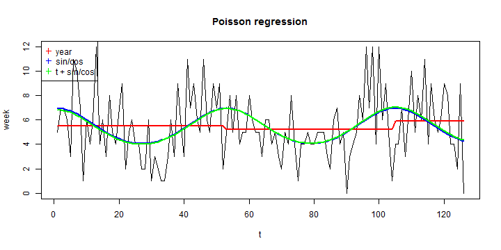 

```r

### Negative Binomial Regression with sin/cos wave
```

```r
require(MASS)
fitNB1 = glm.nb(week ~ year.f)
fitNB1AR1 = glm.nb(week ~ year.f + tminus1)
fitNB1AR2 = glm.nb(week ~ year.f + tminus1 + tminus2)
fitNB1AR3 = glm.nb(week ~ year.f + tminus1 + tminus2 + tminus3)
fitNB1AR4 = glm.nb(week ~ year.f + tminus1 + tminus2 + tminus3 + tminus4)

fitNB2 = glm.nb(week ~ sin + cos)
fitNB2AR1 = glm.nb(week ~ sin + cos + tminus1)
fitNB2AR2 = glm.nb(week ~ sin + cos + tminus1 + tminus2)
fitNB2AR3 = glm.nb(week ~ sin + cos + tminus1 + tminus2 + tminus3)
fitNB2AR4 = glm.nb(week ~ sin + cos + tminus1 + tminus2 + tminus3 + tminus4)

fitNB3 = glm.nb(week ~ t + sin + cos)
fitNB3AR1 = glm.nb(week ~ t + sin + cos + tminus1)
fitNB3AR2 = glm.nb(week ~ t + sin + cos + tminus1 + tminus2)
fitNB3AR3 = glm.nb(week ~ t + sin + cos + tminus1 + tminus2 + tminus3)
fitNB3AR4 = glm.nb(week ~ t + sin + cos + tminus1 + tminus2 + tminus3 + tminus4)
```


```r
# Printing AICs
AR_NB1 <- c(fitNB1 = fitNB1$aic, fitNB1AR1 = fitNB1AR1$aic, fitNB1AR2 = fitNB1AR2$aic, 
    fitNB1AR3 = fitNB1AR3$aic, fitNB1AR4 = fitNB1AR4$aic)
AR_NB2 <- c(fitNB2 = fitNB2$aic, fitNB2AR1 = fitNB2AR1$aic, fitNB2AR2 = fitNB2AR2$aic, 
    fitNB2AR3 = fitNB2AR3$aic, fitNB2AR4 = fitNB2AR4$aic)
AR_NB3 <- c(fitNB3 = fitNB3$aic, fitNB3AR1 = fitNB3AR1$aic, fitNB3AR2 = fitNB3AR2$aic, 
    fitNB3AR3 = fitNB3AR3$aic, fitNB3AR4 = fitNB3AR4$aic)
print(AR_NB1)
```

```
##    fitNB1 fitNB1AR1 fitNB1AR2 fitNB1AR3 fitNB1AR4 
##     609.7     610.6     604.6     606.2     607.2
```

```r
print(AR_NB2)
```

```
##    fitNB2 fitNB2AR1 fitNB2AR2 fitNB2AR3 fitNB2AR4 
##     591.4     593.2     592.7     594.6     596.5
```

```r
print(AR_NB3)
```

```
##    fitNB3 fitNB3AR1 fitNB3AR2 fitNB3AR3 fitNB3AR4 
##     593.3     595.1     594.6     596.5     598.5
```


```r
plot(t, week, type = "l", main = "Negative Binomial Regression")
lines(fitNB1$fit, col = "red", lwd = 2)
lines(fitNB2$fit, col = "blue", lwd = 2)
lines(fitNB3$fit, col = "green", lwd = 2)
legend("topleft", pch = 3, col = c("red", "blue", "green"), c("year", "sin/cos", 
    "t + sin/cos"))
```

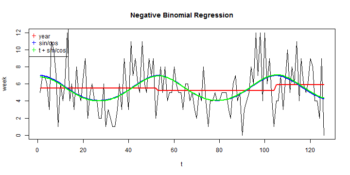 


## Musculoskeletal

```r
# create time series
s = 3
week <- matrix.week[, s]
week.ts <- ts(week, start = c(x@dates$year[1], x@dates$week[1]), frequency = frequency)
t = 1:length(week)
```


```r
# Plot series
plot(week.ts, xlab = "Weeks", main = "Weeks")
```

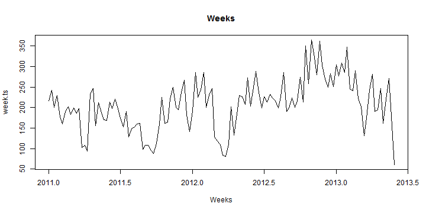 


### Summary statistics

```r
# Percentiles
quantile(week, probs = c(0, 0.25, 0.5, 0.75, 1), names = FALSE)
```

```
## [1]  61.0 168.5 202.5 244.8 365.0
```

```r
round(mean(week), 4)
```

```
## [1] 206.8
```

```r

# Number of weeks at minimum value
(countInMin <- length(which(week == min(week))))
```

```
## [1] 1
```

```r
(percentInMin <- round(((countInMin)/(length(week))) * 100, 2))
```

```
## [1] 0.79
```


```r
# ACF and PACF
acf(week, main = "ACF for weekly data", lag.max = (frequency + 5))
```

 

```r
pacf(week, main = "PACF for weekly data", lag.max = (frequency + 5))
```

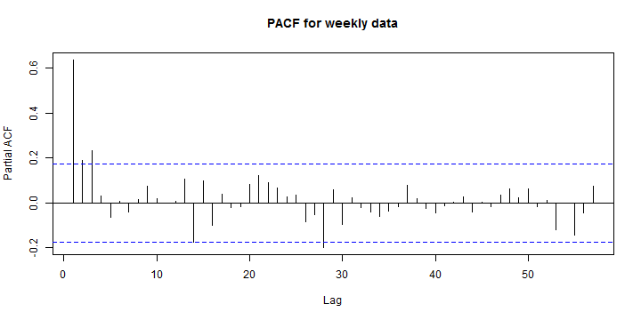 


### Crude (visual) assessment of temporal effects

```r
boxplot(week ~ x@dates$week, main = "Week of the year")
```

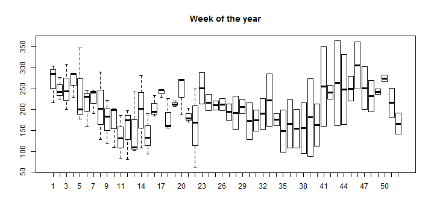 

```r
boxplot(week ~ x@dates$year, main = "Year")
```

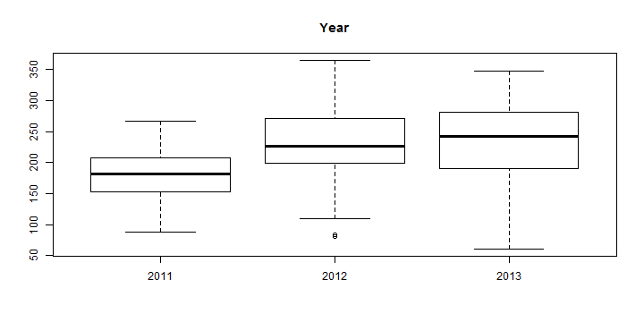 


### POISSON  Regression with sin/cos wave

```r
distribution = "poisson"

cos = cos(2 * pi * t/frequency)
sin = sin(2 * pi * t/frequency)
year.f <- as.factor(x@dates$year)
tminus1 <- c(week[1], week[1:(length(week) - 1)])
tminus2 <- c(week[1:2], week[1:(length(week) - 2)])
tminus3 <- c(week[1:3], week[1:(length(week) - 3)])
tminus4 <- c(week[1:4], week[1:(length(week) - 4)])

fit1 = glm(week ~ year.f, family = distribution)
fit1AR1 = glm(week ~ year.f + tminus1, family = distribution)
fit1AR2 = glm(week ~ year.f + tminus1 + tminus2, family = distribution)
fit1AR3 = glm(week ~ year.f + tminus1 + tminus2 + tminus3, family = distribution)
fit1AR4 = glm(week ~ year.f + tminus1 + tminus2 + tminus3 + tminus4, family = distribution)

fit2 = glm(week ~ sin + cos, family = distribution)
fit2AR1 = glm(week ~ sin + cos + tminus1, family = distribution)
fit2AR2 = glm(week ~ sin + cos + tminus1 + tminus2, family = distribution)
fit2AR3 = glm(week ~ sin + cos + tminus1 + tminus2 + tminus3, family = distribution)
fit2AR4 = glm(week ~ sin + cos + tminus1 + tminus2 + tminus3 + tminus4, family = distribution)

fit3 = glm(week ~ t + sin + cos, family = distribution)
fit3AR1 = glm(week ~ t + sin + cos + tminus1, family = distribution)
fit3AR2 = glm(week ~ t + sin + cos + tminus1 + tminus2, family = distribution)
fit3AR3 = glm(week ~ t + sin + cos + tminus1 + tminus2 + tminus3, family = distribution)
fit3AR4 = glm(week ~ t + sin + cos + tminus1 + tminus2 + tminus3 + tminus4, 
    family = distribution)
```


```r
# Printing AICs
AR1 <- c(fit1 = fit1$aic, fit1AR1 = fit1AR1$aic, fit1AR2 = fit1AR2$aic, fit1AR3 = fit1AR3$aic, 
    fit1AR4 = fit1AR4$aic)
AR2 <- c(fit2 = fit2$aic, fit2AR1 = fit2AR1$aic, fit2AR2 = fit2AR2$aic, fit2AR3 = fit2AR3$aic, 
    fit2AR4 = fit2AR4$aic)
AR3 <- c(fit3 = fit3$aic, fit3AR1 = fit3AR1$aic, fit3AR2 = fit3AR2$aic, fit3AR3 = fit3AR3$aic, 
    fit3AR4 = fit3AR4$aic)


print(AR1)
```

```
##    fit1 fit1AR1 fit1AR2 fit1AR3 fit1AR4 
##    2966    2327    2293    2253    2255
```

```r
print(AR2)
```

```
##    fit2 fit2AR1 fit2AR2 fit2AR3 fit2AR4 
##    3129    2351    2311    2264    2265
```

```r
print(AR3)
```

```
##    fit3 fit3AR1 fit3AR2 fit3AR3 fit3AR4 
##    2750    2307    2286    2251    2253
```


```r
plot(t, week, type = "l", main = "Poisson regression")
lines(fit1$fit, col = "red", lwd = 2)
lines(fit2$fit, col = "blue", lwd = 2)
lines(fit3$fit, col = "green", lwd = 2)
legend("topleft", pch = 3, col = c("red", "blue", "green"), c("year", "sin/cos", 
    "t + sin/cos"))
```

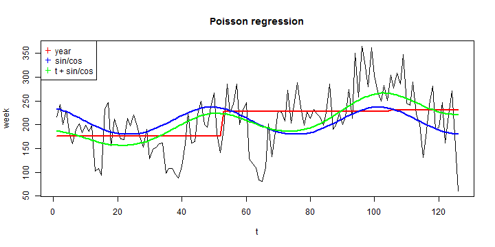 

```r

### Negative Binomial Regression with sin/cos wave
```

```r
require(MASS)
fitNB1 = glm.nb(week ~ year.f)
fitNB1AR1 = glm.nb(week ~ year.f + tminus1)
fitNB1AR2 = glm.nb(week ~ year.f + tminus1 + tminus2)
fitNB1AR3 = glm.nb(week ~ year.f + tminus1 + tminus2 + tminus3)
fitNB1AR4 = glm.nb(week ~ year.f + tminus1 + tminus2 + tminus3 + tminus4)

fitNB2 = glm.nb(week ~ sin + cos)
fitNB2AR1 = glm.nb(week ~ sin + cos + tminus1)
fitNB2AR2 = glm.nb(week ~ sin + cos + tminus1 + tminus2)
fitNB2AR3 = glm.nb(week ~ sin + cos + tminus1 + tminus2 + tminus3)
fitNB2AR4 = glm.nb(week ~ sin + cos + tminus1 + tminus2 + tminus3 + tminus4)

fitNB3 = glm.nb(week ~ t + sin + cos)
fitNB3AR1 = glm.nb(week ~ t + sin + cos + tminus1)
fitNB3AR2 = glm.nb(week ~ t + sin + cos + tminus1 + tminus2)
fitNB3AR3 = glm.nb(week ~ t + sin + cos + tminus1 + tminus2 + tminus3)
fitNB3AR4 = glm.nb(week ~ t + sin + cos + tminus1 + tminus2 + tminus3 + tminus4)
```


```r
# Printing AICs
AR_NB1 <- c(fitNB1 = fitNB1$aic, fitNB1AR1 = fitNB1AR1$aic, fitNB1AR2 = fitNB1AR2$aic, 
    fitNB1AR3 = fitNB1AR3$aic, fitNB1AR4 = fitNB1AR4$aic)
AR_NB2 <- c(fitNB2 = fitNB2$aic, fitNB2AR1 = fitNB2AR1$aic, fitNB2AR2 = fitNB2AR2$aic, 
    fitNB2AR3 = fitNB2AR3$aic, fitNB2AR4 = fitNB2AR4$aic)
AR_NB3 <- c(fitNB3 = fitNB3$aic, fitNB3AR1 = fitNB3AR1$aic, fitNB3AR2 = fitNB3AR2$aic, 
    fitNB3AR3 = fitNB3AR3$aic, fitNB3AR4 = fitNB3AR4$aic)
print(AR_NB1)
```

```
##    fitNB1 fitNB1AR1 fitNB1AR2 fitNB1AR3 fitNB1AR4 
##      1392      1347      1347      1346      1348
```

```r
print(AR_NB2)
```

```
##    fitNB2 fitNB2AR1 fitNB2AR2 fitNB2AR3 fitNB2AR4 
##      1402      1349      1349      1348      1350
```

```r
print(AR_NB3)
```

```
##    fitNB3 fitNB3AR1 fitNB3AR2 fitNB3AR3 fitNB3AR4 
##      1384      1348      1349      1349      1351
```


```r
plot(t, week, type = "l", main = "Negative Binomial Regression")
lines(fitNB1$fit, col = "red", lwd = 2)
lines(fitNB2$fit, col = "blue", lwd = 2)
lines(fitNB3$fit, col = "green", lwd = 2)
legend("topleft", pch = 3, col = c("red", "blue", "green"), c("year", "sin/cos", 
    "t + sin/cos"))
```

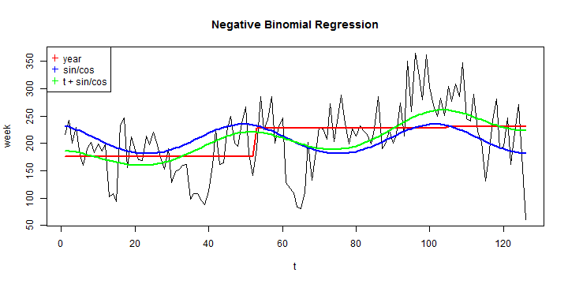 


## Respiratory

```r
# create time series
s = 4
week <- matrix.week[, s]
week.ts <- ts(week, start = c(x@dates$year[1], x@dates$week[1]), frequency = frequency)
t = 1:length(week)
```


```r
# Plot series
plot(week.ts, xlab = "Weeks", main = "Weeks")
```

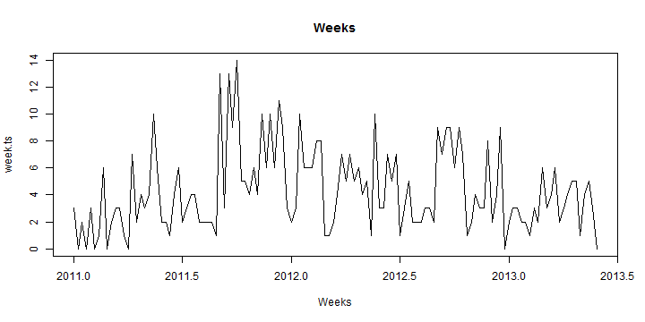 


### Summary statistics

```r
# Percentiles
quantile(week, probs = c(0, 0.25, 0.5, 0.75, 1), names = FALSE)
```

```
## [1]  0.0  2.0  3.5  6.0 14.0
```

```r
round(mean(week), 4)
```

```
## [1] 4.317
```

```r

# Number of weeks at minimum value
(countInMin <- length(which(week == min(week))))
```

```
## [1] 7
```

```r
(percentInMin <- round(((countInMin)/(length(week))) * 100, 2))
```

```
## [1] 5.56
```


```r
# ACF and PACF
acf(week, main = "ACF for weekly data", lag.max = (frequency + 5))
```

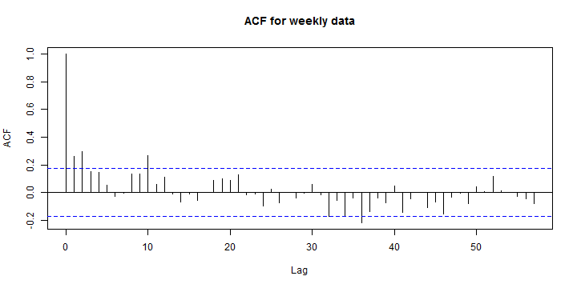 

```r
pacf(week, main = "PACF for weekly data", lag.max = (frequency + 5))
```

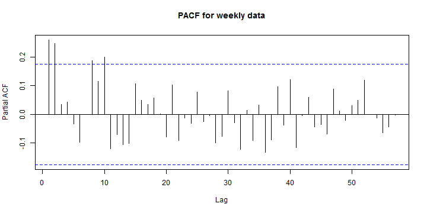 


### Crude (visual) assessment of temporal effects

```r
boxplot(week ~ x@dates$week, main = "Week of the year")
```

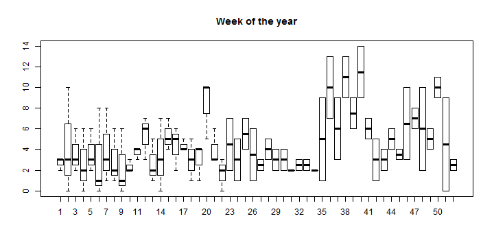 

```r
boxplot(week ~ x@dates$year, main = "Year")
```

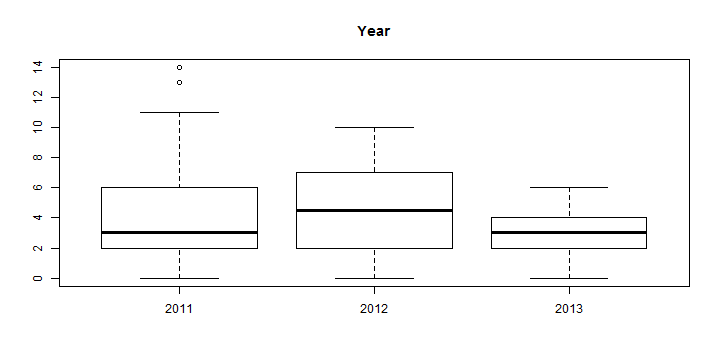 


### POISSON  Regression with sin/cos wave

```r
distribution = "poisson"

cos = cos(2 * pi * t/frequency)
sin = sin(2 * pi * t/frequency)
year.f <- as.factor(x@dates$year)
tminus1 <- c(week[1], week[1:(length(week) - 1)])
tminus2 <- c(week[1:2], week[1:(length(week) - 2)])
tminus3 <- c(week[1:3], week[1:(length(week) - 3)])
tminus4 <- c(week[1:4], week[1:(length(week) - 4)])

fit1 = glm(week ~ year.f, family = distribution)
fit1AR1 = glm(week ~ year.f + tminus1, family = distribution)
fit1AR2 = glm(week ~ year.f + tminus1 + tminus2, family = distribution)
fit1AR3 = glm(week ~ year.f + tminus1 + tminus2 + tminus3, family = distribution)
fit1AR4 = glm(week ~ year.f + tminus1 + tminus2 + tminus3 + tminus4, family = distribution)

fit2 = glm(week ~ sin + cos, family = distribution)
fit2AR1 = glm(week ~ sin + cos + tminus1, family = distribution)
fit2AR2 = glm(week ~ sin + cos + tminus1 + tminus2, family = distribution)
fit2AR3 = glm(week ~ sin + cos + tminus1 + tminus2 + tminus3, family = distribution)
fit2AR4 = glm(week ~ sin + cos + tminus1 + tminus2 + tminus3 + tminus4, family = distribution)

fit3 = glm(week ~ t + sin + cos, family = distribution)
fit3AR1 = glm(week ~ t + sin + cos + tminus1, family = distribution)
fit3AR2 = glm(week ~ t + sin + cos + tminus1 + tminus2, family = distribution)
fit3AR3 = glm(week ~ t + sin + cos + tminus1 + tminus2 + tminus3, family = distribution)
fit3AR4 = glm(week ~ t + sin + cos + tminus1 + tminus2 + tminus3 + tminus4, 
    family = distribution)
```


```r
# Printing AICs
AR1 <- c(fit1 = fit1$aic, fit1AR1 = fit1AR1$aic, fit1AR2 = fit1AR2$aic, fit1AR3 = fit1AR3$aic, 
    fit1AR4 = fit1AR4$aic)
AR2 <- c(fit2 = fit2$aic, fit2AR1 = fit2AR1$aic, fit2AR2 = fit2AR2$aic, fit2AR3 = fit2AR3$aic, 
    fit2AR4 = fit2AR4$aic)
AR3 <- c(fit3 = fit3$aic, fit3AR1 = fit3AR1$aic, fit3AR2 = fit3AR2$aic, fit3AR3 = fit3AR3$aic, 
    fit3AR4 = fit3AR4$aic)


print(AR1)
```

```
##    fit1 fit1AR1 fit1AR2 fit1AR3 fit1AR4 
##   647.9   636.7   624.3   626.1   627.7
```

```r
print(AR2)
```

```
##    fit2 fit2AR1 fit2AR2 fit2AR3 fit2AR4 
##   638.5   631.4   622.0   623.9   625.6
```

```r
print(AR3)
```

```
##    fit3 fit3AR1 fit3AR2 fit3AR3 fit3AR4 
##   640.5   633.3   623.9   625.9   627.6
```


```r
plot(t, week, type = "l", main = "Poisson regression")
lines(fit1$fit, col = "red", lwd = 2)
lines(fit2$fit, col = "blue", lwd = 2)
lines(fit3$fit, col = "green", lwd = 2)
legend("topleft", pch = 3, col = c("red", "blue", "green"), c("year", "sin/cos", 
    "t + sin/cos"))
```

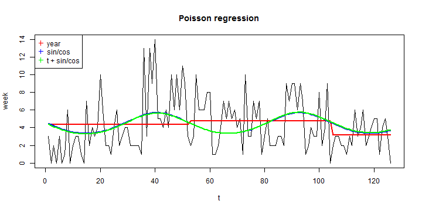 

```r

### Negative Binomial Regression with sin/cos wave
```

```r
require(MASS)
fitNB1 = glm.nb(week ~ year.f)
fitNB1AR1 = glm.nb(week ~ year.f + tminus1)
fitNB1AR2 = glm.nb(week ~ year.f + tminus1 + tminus2)
fitNB1AR3 = glm.nb(week ~ year.f + tminus1 + tminus2 + tminus3)
fitNB1AR4 = glm.nb(week ~ year.f + tminus1 + tminus2 + tminus3 + tminus4)

fitNB2 = glm.nb(week ~ sin + cos)
fitNB2AR1 = glm.nb(week ~ sin + cos + tminus1)
fitNB2AR2 = glm.nb(week ~ sin + cos + tminus1 + tminus2)
fitNB2AR3 = glm.nb(week ~ sin + cos + tminus1 + tminus2 + tminus3)
fitNB2AR4 = glm.nb(week ~ sin + cos + tminus1 + tminus2 + tminus3 + tminus4)

fitNB3 = glm.nb(week ~ t + sin + cos)
fitNB3AR1 = glm.nb(week ~ t + sin + cos + tminus1)
fitNB3AR2 = glm.nb(week ~ t + sin + cos + tminus1 + tminus2)
fitNB3AR3 = glm.nb(week ~ t + sin + cos + tminus1 + tminus2 + tminus3)
fitNB3AR4 = glm.nb(week ~ t + sin + cos + tminus1 + tminus2 + tminus3 + tminus4)
```


```r
# Printing AICs
AR_NB1 <- c(fitNB1 = fitNB1$aic, fitNB1AR1 = fitNB1AR1$aic, fitNB1AR2 = fitNB1AR2$aic, 
    fitNB1AR3 = fitNB1AR3$aic, fitNB1AR4 = fitNB1AR4$aic)
AR_NB2 <- c(fitNB2 = fitNB2$aic, fitNB2AR1 = fitNB2AR1$aic, fitNB2AR2 = fitNB2AR2$aic, 
    fitNB2AR3 = fitNB2AR3$aic, fitNB2AR4 = fitNB2AR4$aic)
AR_NB3 <- c(fitNB3 = fitNB3$aic, fitNB3AR1 = fitNB3AR1$aic, fitNB3AR2 = fitNB3AR2$aic, 
    fitNB3AR3 = fitNB3AR3$aic, fitNB3AR4 = fitNB3AR4$aic)
print(AR_NB1)
```

```
##    fitNB1 fitNB1AR1 fitNB1AR2 fitNB1AR3 fitNB1AR4 
##     610.9     606.3     601.4     603.2     604.9
```

```r
print(AR_NB2)
```

```
##    fitNB2 fitNB2AR1 fitNB2AR2 fitNB2AR3 fitNB2AR4 
##     607.0     604.1     600.7     602.5     604.2
```

```r
print(AR_NB3)
```

```
##    fitNB3 fitNB3AR1 fitNB3AR2 fitNB3AR3 fitNB3AR4 
##     608.9     606.0     602.6     604.4     606.2
```


```r
plot(t, week, type = "l", main = "Negative Binomial Regression")
lines(fitNB1$fit, col = "red", lwd = 2)
lines(fitNB2$fit, col = "blue", lwd = 2)
lines(fitNB3$fit, col = "green", lwd = 2)
legend("topleft", pch = 3, col = c("red", "blue", "green"), c("year", "sin/cos", 
    "t + sin/cos"))
```

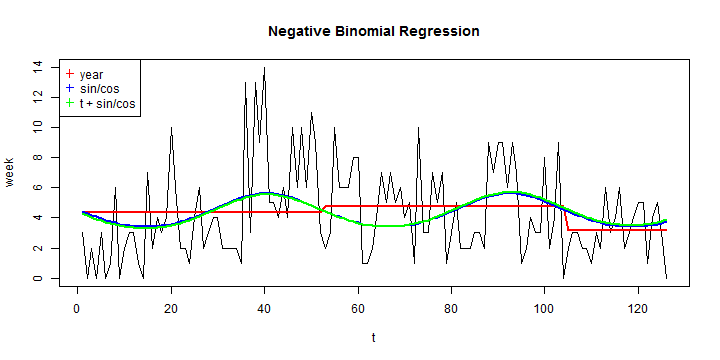 


## Systemic

```r
# create time series
s = 5
week <- matrix.week[, s]
week.ts <- ts(week, start = c(x@dates$year[1], x@dates$week[1]), frequency = frequency)
t = 1:length(week)
```


```r
# Plot series
plot(week.ts, xlab = "Weeks", main = "Weeks")
```

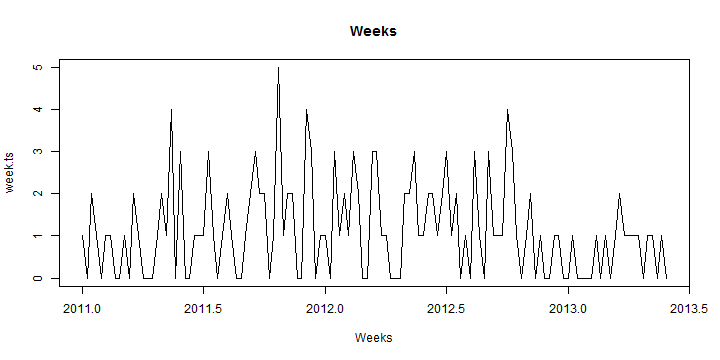 


### Summary statistics

```r
# Percentiles
quantile(week, probs = c(0, 0.25, 0.5, 0.75, 1), names = FALSE)
```

```
## [1] 0 0 1 2 5
```

```r
round(mean(week), 4)
```

```
## [1] 1.127
```

```r

# Number of weeks at minimum value
(countInMin <- length(which(week == min(week))))
```

```
## [1] 42
```

```r
(percentInMin <- round(((countInMin)/(length(week))) * 100, 2))
```

```
## [1] 33.33
```


```r
# ACF and PACF
acf(week, main = "ACF for weekly data", lag.max = (frequency + 5))
```

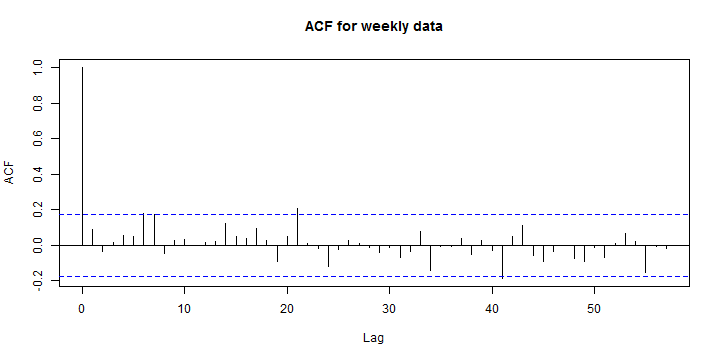 

```r
pacf(week, main = "PACF for weekly data", lag.max = (frequency + 5))
```

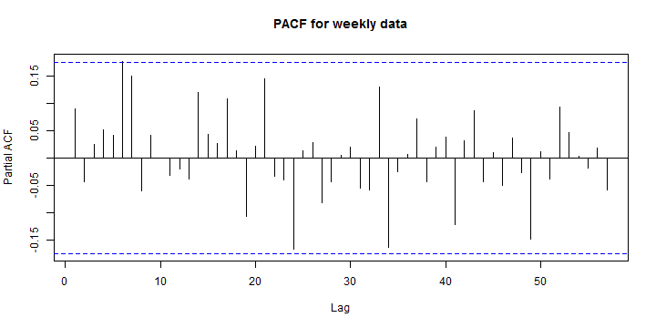 


### Crude (visual) assessment of temporal effects

```r
boxplot(week ~ x@dates$week, main = "Week of the year")
```

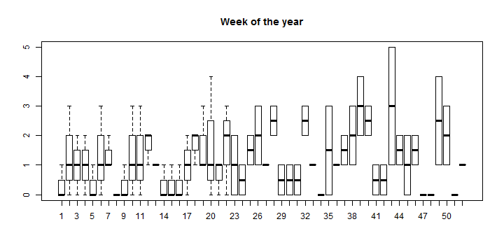 

```r
boxplot(week ~ x@dates$year, main = "Year")
```

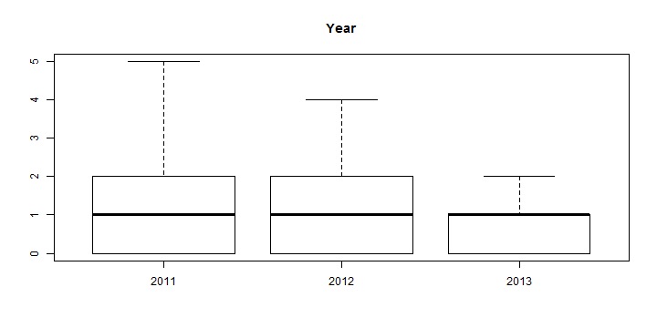 


### POISSON  Regression with sin/cos wave

```r
distribution = "poisson"

cos = cos(2 * pi * t/frequency)
sin = sin(2 * pi * t/frequency)
year.f <- as.factor(x@dates$year)
tminus1 <- c(week[1], week[1:(length(week) - 1)])
tminus2 <- c(week[1:2], week[1:(length(week) - 2)])
tminus3 <- c(week[1:3], week[1:(length(week) - 3)])
tminus4 <- c(week[1:4], week[1:(length(week) - 4)])

fit1 = glm(week ~ year.f, family = distribution)
fit1AR1 = glm(week ~ year.f + tminus1, family = distribution)
fit1AR2 = glm(week ~ year.f + tminus1 + tminus2, family = distribution)
fit1AR3 = glm(week ~ year.f + tminus1 + tminus2 + tminus3, family = distribution)
fit1AR4 = glm(week ~ year.f + tminus1 + tminus2 + tminus3 + tminus4, family = distribution)

fit2 = glm(week ~ sin + cos, family = distribution)
fit2AR1 = glm(week ~ sin + cos + tminus1, family = distribution)
fit2AR2 = glm(week ~ sin + cos + tminus1 + tminus2, family = distribution)
fit2AR3 = glm(week ~ sin + cos + tminus1 + tminus2 + tminus3, family = distribution)
fit2AR4 = glm(week ~ sin + cos + tminus1 + tminus2 + tminus3 + tminus4, family = distribution)

fit3 = glm(week ~ t + sin + cos, family = distribution)
fit3AR1 = glm(week ~ t + sin + cos + tminus1, family = distribution)
fit3AR2 = glm(week ~ t + sin + cos + tminus1 + tminus2, family = distribution)
fit3AR3 = glm(week ~ t + sin + cos + tminus1 + tminus2 + tminus3, family = distribution)
fit3AR4 = glm(week ~ t + sin + cos + tminus1 + tminus2 + tminus3 + tminus4, 
    family = distribution)
```


```r
# Printing AICs
AR1 <- c(fit1 = fit1$aic, fit1AR1 = fit1AR1$aic, fit1AR2 = fit1AR2$aic, fit1AR3 = fit1AR3$aic, 
    fit1AR4 = fit1AR4$aic)
AR2 <- c(fit2 = fit2$aic, fit2AR1 = fit2AR1$aic, fit2AR2 = fit2AR2$aic, fit2AR3 = fit2AR3$aic, 
    fit2AR4 = fit2AR4$aic)
AR3 <- c(fit3 = fit3$aic, fit3AR1 = fit3AR1$aic, fit3AR2 = fit3AR2$aic, fit3AR3 = fit3AR3$aic, 
    fit3AR4 = fit3AR4$aic)


print(AR1)
```

```
##    fit1 fit1AR1 fit1AR2 fit1AR3 fit1AR4 
##   349.3   351.1   352.2   354.2   356.2
```

```r
print(AR2)
```

```
##    fit2 fit2AR1 fit2AR2 fit2AR3 fit2AR4 
##   352.5   354.1   355.5   357.5   359.4
```

```r
print(AR3)
```

```
##    fit3 fit3AR1 fit3AR2 fit3AR3 fit3AR4 
##   353.6   355.3   356.6   358.6   360.5
```


```r
plot(t, week, type = "l", main = "Poisson regression")
lines(fit1$fit, col = "red", lwd = 2)
lines(fit2$fit, col = "blue", lwd = 2)
lines(fit3$fit, col = "green", lwd = 2)
legend("topleft", pch = 3, col = c("red", "blue", "green"), c("year", "sin/cos", 
    "t + sin/cos"))
```

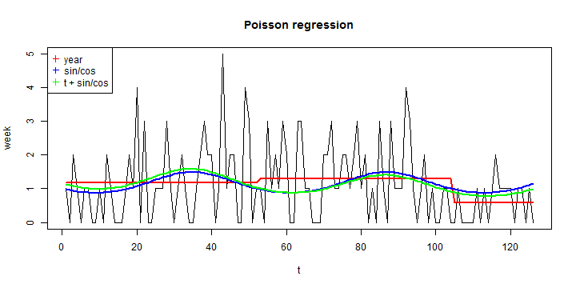 

```r

### Negative Binomial Regression with sin/cos wave
```

```r
require(MASS)
fitNB1 = glm.nb(week ~ year.f)
fitNB1AR1 = glm.nb(week ~ year.f + tminus1)
fitNB1AR2 = glm.nb(week ~ year.f + tminus1 + tminus2)
fitNB1AR3 = glm.nb(week ~ year.f + tminus1 + tminus2 + tminus3)
fitNB1AR4 = glm.nb(week ~ year.f + tminus1 + tminus2 + tminus3 + tminus4)

fitNB2 = glm.nb(week ~ sin + cos)
fitNB2AR1 = glm.nb(week ~ sin + cos + tminus1)
fitNB2AR2 = glm.nb(week ~ sin + cos + tminus1 + tminus2)
fitNB2AR3 = glm.nb(week ~ sin + cos + tminus1 + tminus2 + tminus3)
fitNB2AR4 = glm.nb(week ~ sin + cos + tminus1 + tminus2 + tminus3 + tminus4)

fitNB3 = glm.nb(week ~ t + sin + cos)
fitNB3AR1 = glm.nb(week ~ t + sin + cos + tminus1)
fitNB3AR2 = glm.nb(week ~ t + sin + cos + tminus1 + tminus2)
fitNB3AR3 = glm.nb(week ~ t + sin + cos + tminus1 + tminus2 + tminus3)
fitNB3AR4 = glm.nb(week ~ t + sin + cos + tminus1 + tminus2 + tminus3 + tminus4)
```


```r
# Printing AICs
AR_NB1 <- c(fitNB1 = fitNB1$aic, fitNB1AR1 = fitNB1AR1$aic, fitNB1AR2 = fitNB1AR2$aic, 
    fitNB1AR3 = fitNB1AR3$aic, fitNB1AR4 = fitNB1AR4$aic)
AR_NB2 <- c(fitNB2 = fitNB2$aic, fitNB2AR1 = fitNB2AR1$aic, fitNB2AR2 = fitNB2AR2$aic, 
    fitNB2AR3 = fitNB2AR3$aic, fitNB2AR4 = fitNB2AR4$aic)
AR_NB3 <- c(fitNB3 = fitNB3$aic, fitNB3AR1 = fitNB3AR1$aic, fitNB3AR2 = fitNB3AR2$aic, 
    fitNB3AR3 = fitNB3AR3$aic, fitNB3AR4 = fitNB3AR4$aic)
print(AR_NB1)
```

```
##    fitNB1 fitNB1AR1 fitNB1AR2 fitNB1AR3 fitNB1AR4 
##     351.2     353.1     354.2     356.2     358.2
```

```r
print(AR_NB2)
```

```
##    fitNB2 fitNB2AR1 fitNB2AR2 fitNB2AR3 fitNB2AR4 
##     354.4     356.0     357.4     359.4     361.3
```

```r
print(AR_NB3)
```

```
##    fitNB3 fitNB3AR1 fitNB3AR2 fitNB3AR3 fitNB3AR4 
##     355.5     357.2     358.6     360.6     362.4
```


```r
plot(t, week, type = "l", main = "Negative Binomial Regression")
lines(fitNB1$fit, col = "red", lwd = 2)
lines(fitNB2$fit, col = "blue", lwd = 2)
lines(fitNB3$fit, col = "green", lwd = 2)
legend("topleft", pch = 3, col = c("red", "blue", "green"), c("year", "sin/cos", 
    "t + sin/cos"))
```

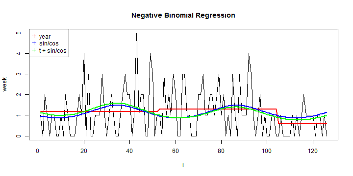 


